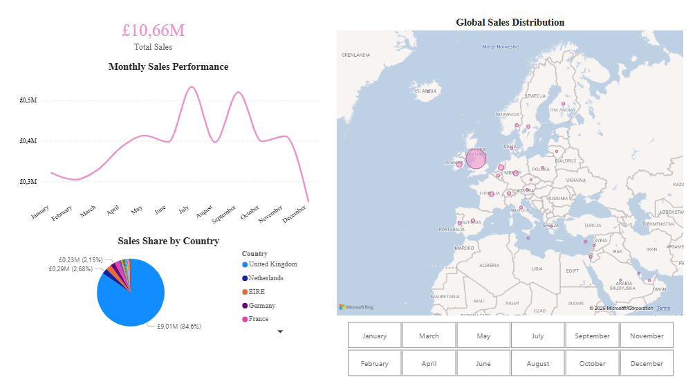

# Online-Retail-Sales-Performance-Analysis

Interactive Power BI dashboard analyzing transnational transactions for a UK-based online retail company (2010-2011). Focuses on sales trends, geographic distribution, and wholesale customer behavior.

# Dashboard Preview

# Business Insights

1. Market Concentration: UK is the dominant market with over 80% share of total revenue.
2. Mid-Year Sales Surges: High sales volume is uniquely concentrated in July and September, suggesting early bulk purchasing behavior by wholesale clients ahead of the holiday season.
3. Secondary Market Leaders: Beyond the UK, the Netherlands and Ireland show the strongest performance, represented by the largest bubbles on the geographic map.
4. Late-Year Decline: Contrary to typical retail trends, sales show a downward trajectory starting from October through December.

# Data

Data obtained via [Kaggle: E-Commerce Data](https://www.kaggle.com/datasets/carrie1/ecommerce-data)

# Technical Implementation

1. Data Modeling: Implemented a Star Schema with Fact and Dimension tables (Calendar, Customers, Products).
2. DAX Measures: Created custom measures for Total Sales and Order Count.
3. Data Cleaning: Used Power Query to handle missing values, remove duplicates, and fix date formatting.
4. Time Intelligence: Built a dynamic Calendar Table to enable monthly and weekly trend analysis.
- Tools Used: Power BI Desktop, DAX, Power Query, Excel (Data)
